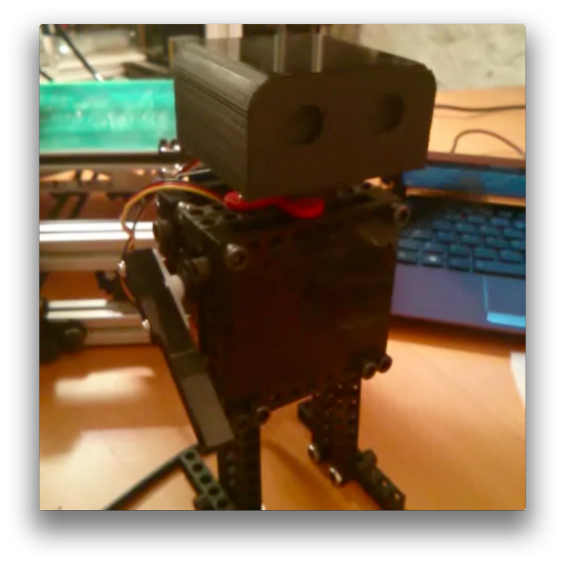

<h2>Dancebot - The Dancing Robot</h2>
<i>By Jason Huggins (@hugs)</i>

<h3>Overview</h3>

In this workshop, you'll assemble a small, humanoid robot designed to dance. The moving parts of the robot are called "Bitbeam". Bitbeam is LEGO Technic-compatible, but made with a 3D printer. 3D printing is a beginner-friendly, low-cost, open-source alternative for creating mechanical robot parts.

Dancebot will have the following features:
<ul>
    <li>Swivel head side to side.</li>
    <li>Rotate each arm up and down.</li>
    <li>Bust a move.</li>
</ul>

 

### Preparations
  
<ul>
    <!-- electronics -->
    <lh><b>Electronics:</b></lh>
    <li>1 Arduino UNO</li>
    <li>1 Arduino Sensor Shield V4</li>

    <li>3 HiTec HS-311 servos</li>
    <li>1 servo horn (round)</li>
    <li>2 servo horns (White, straight)</li>
    <li>6 servo horn mounting screws</li>

     
    <!-- printed parts -->
    <lh><b>Printed parts:</b></lh>
    <li>1 - Dancebot head</li>
    <li>2 - Bitbeam Arduino mounting plate</li>
    <li>4 - Bitbeam servo mounts</li>
    <li>2 - Bitbeam servo arms</li>
    <li>11 - Bitbeam 9x1 beam</li>
    <li>2 - Bitbeam 11x2 plate</li>

     
    <!-- nuts and bolts -->
    <lh><b>Nuts and bolts:</b></lh>    
    <li>8 3/4-inch 10-32 bolts</li>    
    <li>10 1-inch 10-32 bolts</li>
    <li>4 1 1/2-inch 10-32 bolts</li>
    <li>8 6-32 bolts</li>
    <li>2 1/2 inch 4-40 bolts</li>

    <li>22 10-32 nuts</li>    
    <li>8 6-32 nuts</li>
    <li>2 4-40 nuts</li>

     
    <!-- assembly tools -->
    <lh><b>Assembly tools:</b></lh>        
    <li>1 7/32 hex driver</li>
    <li>1 3/32 hex driver</li>
    <li>1 5/32 hex driver</li>        
    <li>1 Phillips #1 screwdriver</li>

</ul> 

### Assembly
[Build instructions are available on Flickr](http://www.flickr.com/photos/68386867@N05/sets/72157642481371803/)

### Programming

#### Arduino
1. Download and install the Arduino Client: [http://arduino.cc/en/Guide/HomePage](http://arduino.cc/en/Guide/HomePage)
2. Follow the setup procedure, and use the "blink" test script to verify your Arduino is working.
3. From the Arduino IDE upload the "Firmata" script: File -> Open -> Examples > Firmata > StandardFirmata

#### Node
1. [Install Node](http://nodejs.org/download/)
2. Install the dependencies: `npm install`
3. Start'er up: `node bot.js`
4. Start dancing: `dance()`

